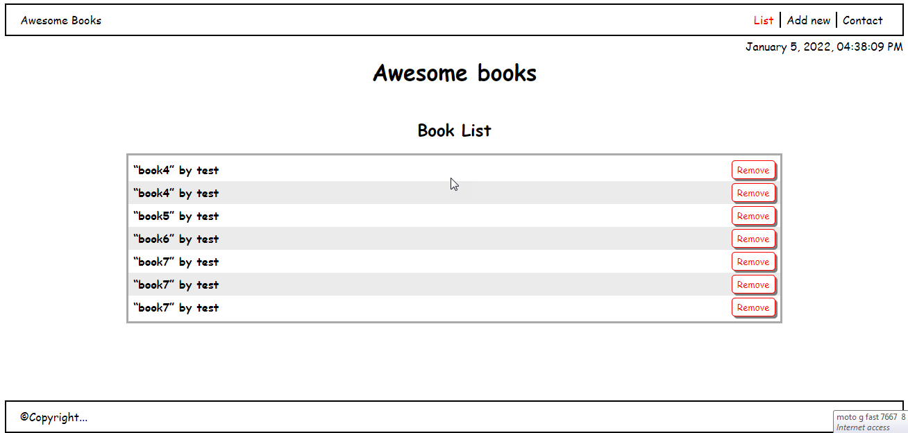
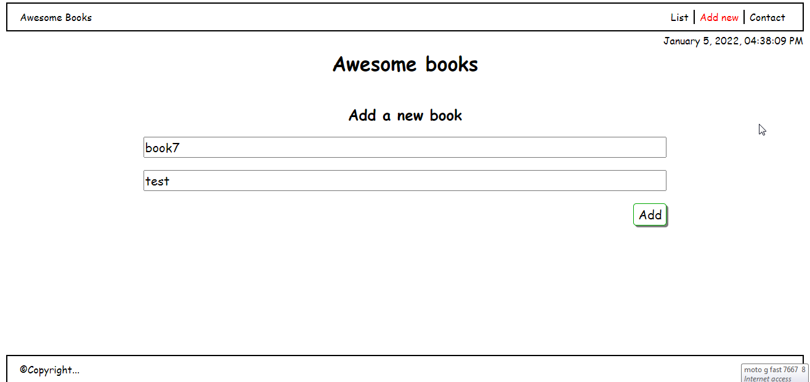
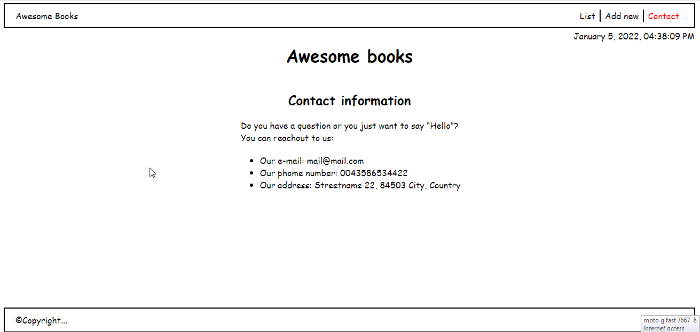
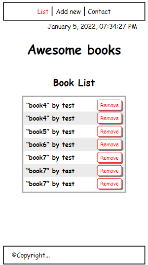

# awesome-books

It is a project for Microverse's JavaScript Module to be done using pair-programming.

### Desktop Version

### Mobile Version

In this website you can add books of your choice to the list of books and save them in your browser's localstorage.

## Built With

- HTML, CSS and JavaScript (ES6)

## Live Demo

- [Live Demo Link](https://gtekle.github.io/awesome-books-with-es6-modules/)
- Live Demo Might not work due to 'luxon' module. So, you checkout it out by intalling it locally following the steps in 'Getting Started' section.

## Getting Started

- Install Node.js
- Install text editor of your choice (eg. VS Code)
- Clone the repository from [here](https://github.com/gtekle/awesome-books-with-es6-modules.git)
- Change directory to 'cd awesome-books-with-es6-modules'
- On the root directory, run 'npm install' on the terminal to install packages.
- Open the index.html file in your browser (using live server) to check your updates and navigate to other pages.

## Authors

👤 **Tekle Gebreyohannes**

- GitHub: [@githubhandle](https://github.com/gtekle)
- LinkedIn: [LinkedIn](www.linkedin.com/in/tekle-gebreyohannes-kidanemariam-7605752b)

👤 **Clinton Mbonu**

- Location: Nigeria
- GitHub: [@clintonjosephs](https://github.com/clintonjosephs)
- Twitter: [@clintonmbonu\_](https://twitter.com/clintonmbonu_)
- LinkedIn: [LinkedIn](https://linkedin.com/in/clinton-mbonu)

👤 **Ola Ishola**

- GitHub: [@netman5](https://github.com/netman5)
- Twitter: [@Orlaish](https://twitter.com/Orlaish)
- LinkedIn: [LinkedIn](https://www.linkedin.com/in/ola-ishola/)

## 🤝 Contributing

Contributions, issues, and feature requests are welcome!

Feel free to check the [issues page](../../issues/).

## Show your support

Give a ⭐️ if you like this project!

## Acknowledgments

- [Microverse Inc](https://www.microverse.org/)

## 📝 License

This project is [MIT](./MIT.md) licensed.
